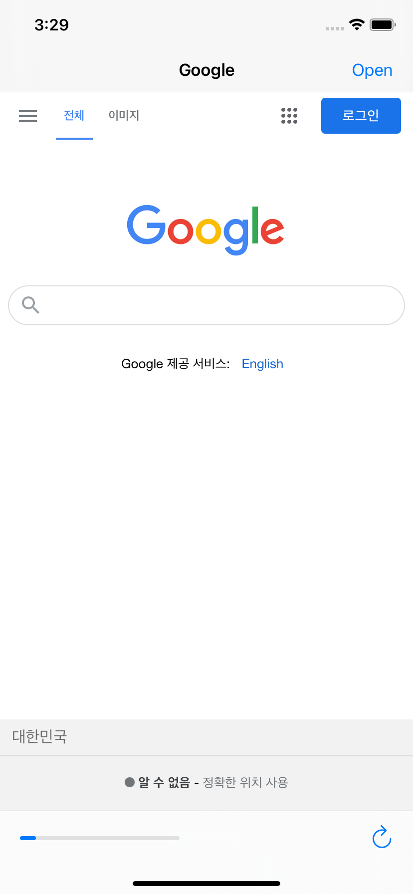
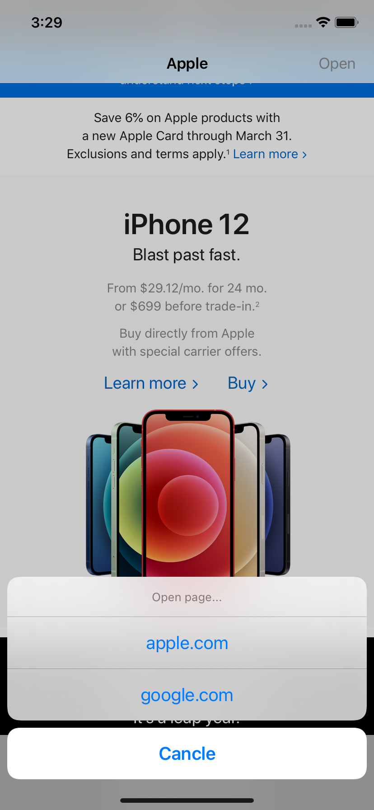

# 100DaysOfSwift
[100 Days of Swift - Hacking with Swift](https://www.hackingwithswift.com/100)

## Table Of Contents
- [Project1: Storm Viewer](#project1-storm-viewer)
- [Project2: Guess the Flag](#project2-guess-the-flag)
- [Project3: Storm Viewer+](#project3-storm-viewer)
- [Milestone1: Project1~3](#milestone1-project13)
- [Project4: Easy Browser](#project4-easy-browser)

## [Project1: Storm Viewer](./Project1)

## [Project2: Guess the Flag](./Project2)

## [Project3: Storm Viewer+](./Project3)

## [Milestone1: Project1~3](./milestone1)

## [Project4: Easy Browser](./Project4)

