# 100DaysOfSwift
[100 Days of Swift - Hacking with Swift](https://www.hackingwithswift.com/100)

## [Project1: Storm Viewer](./Project1)

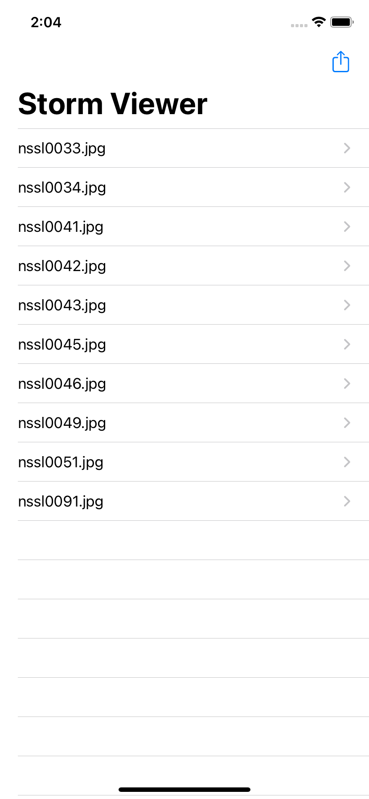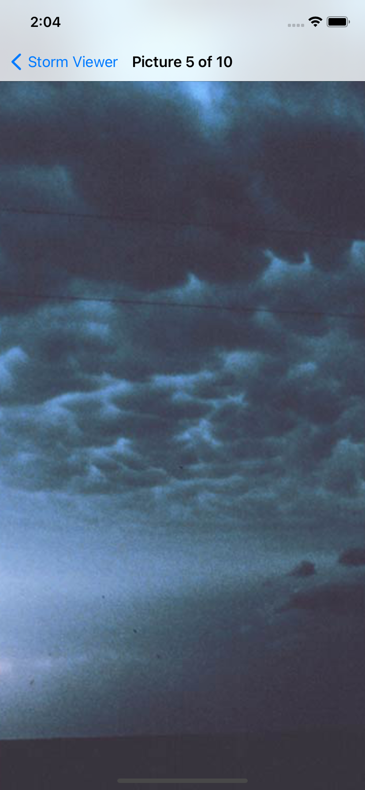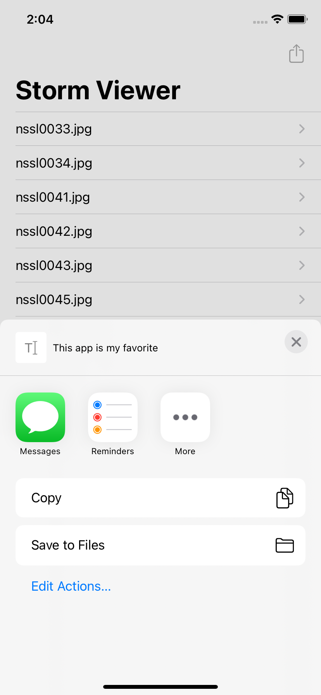

## [Project2: Guess the Flag](./Project2)

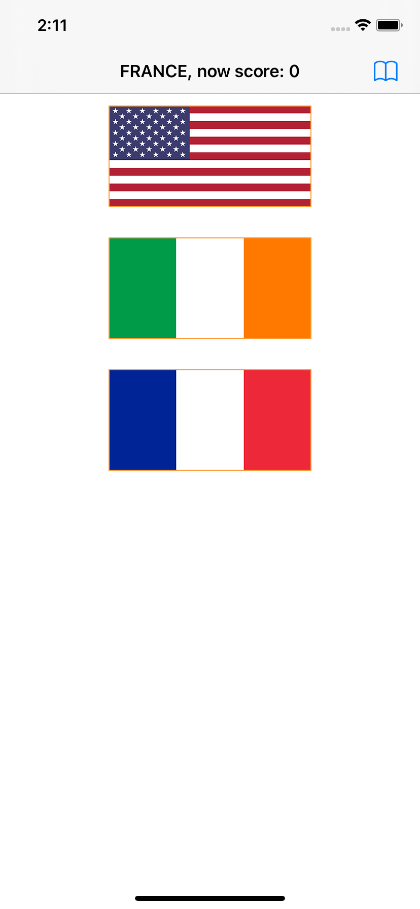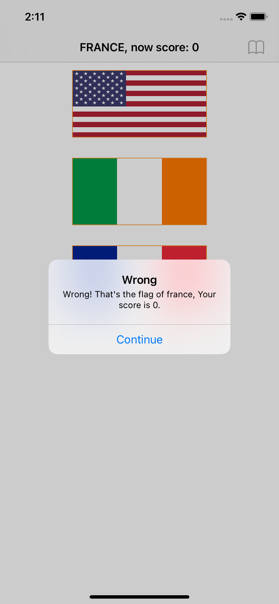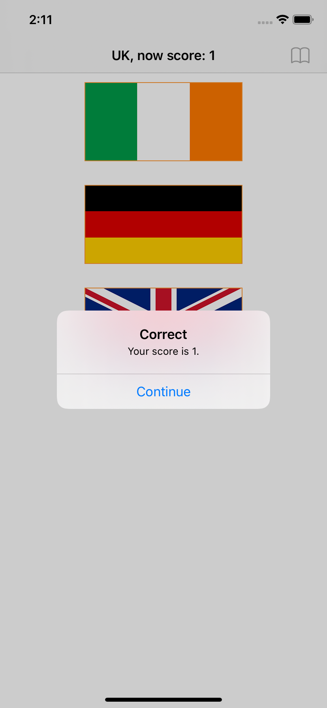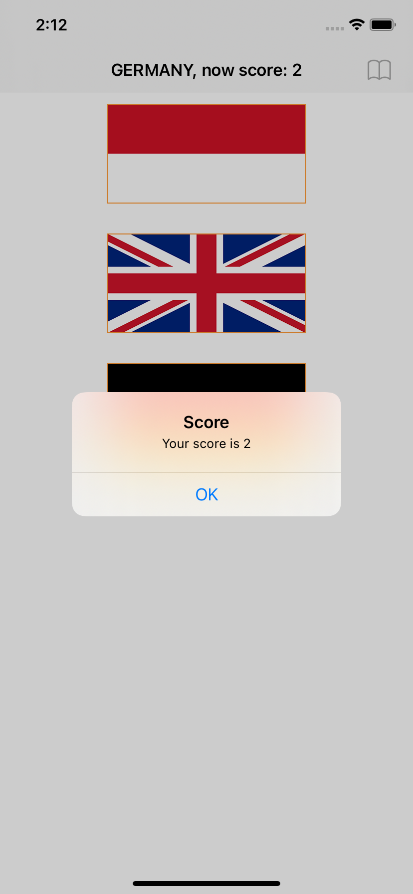

## [Project3: Storm Viewer+](./Project3)

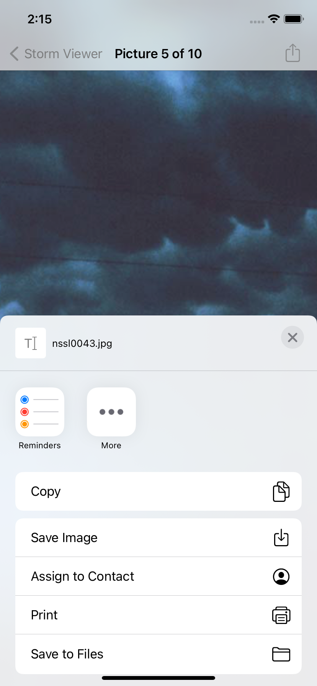

## [Milestone1: Project1~3](./milestone1)

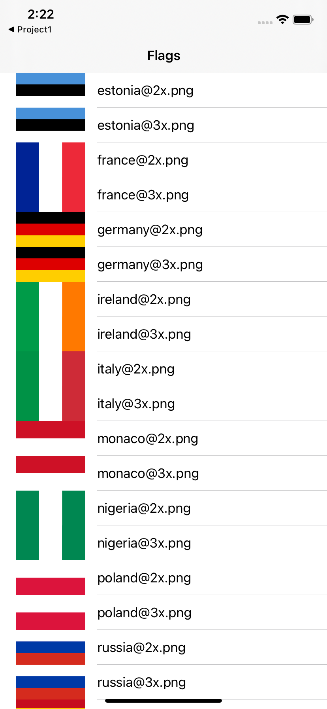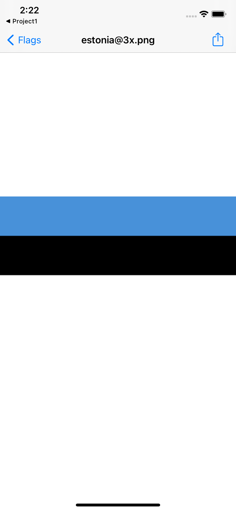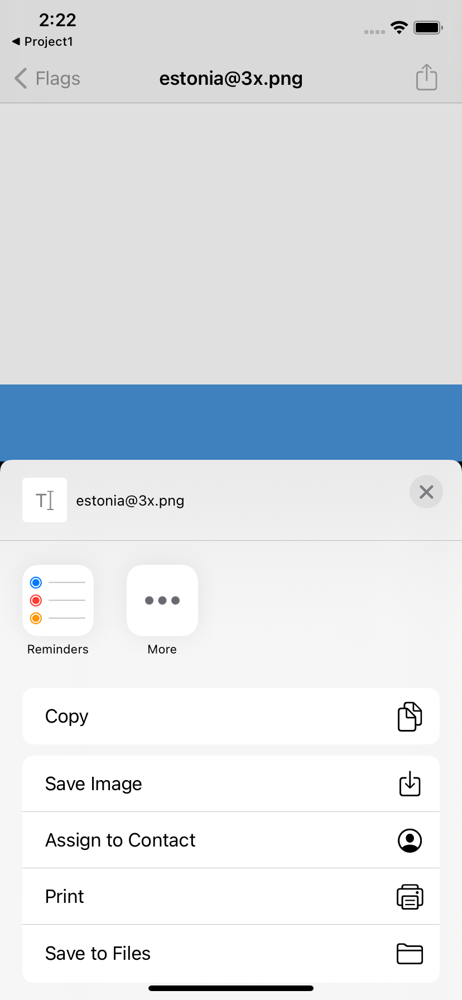